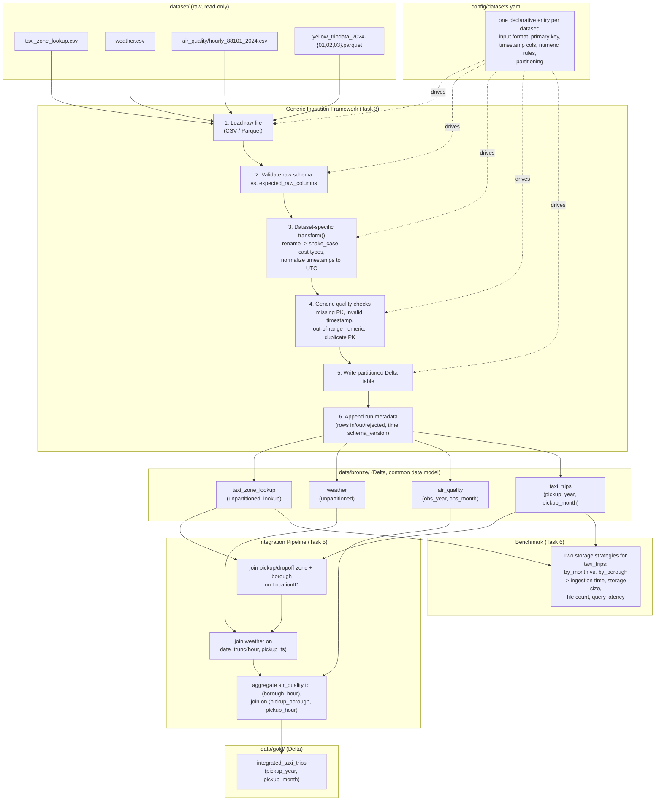

# Architecture Diagram (Task: "A diagram of the architecture")

## Reading this diagram

- **Left to right / top to bottom is the data flow**: raw files never move or
  mutate — every stage reads its input and writes a new artifact.
- **`config/datasets.yaml` drives the entire ingestion box** — none of the five
  ingestion steps hardcode a dataset name; they all read their behavior
  (which columns to expect, how to partition, what counts as invalid) from
  this one file, dispatching to a small per-dataset transform function only
  at step 3.
- **Bronze is the boundary where the common data model becomes true.** Every
  bronze table, regardless of source format or naming convention, is
  guaranteed to have `snake_case` columns, UTC timestamps, and NULL (never
  sentinel) missing values from this point on.
- **Gold is derived, not authoritative.** `integrated_taxi_trips` can always be
  rebuilt from bronze; it exists purely to save downstream analytical queries
  (Week 2) from repeating the same three joins.